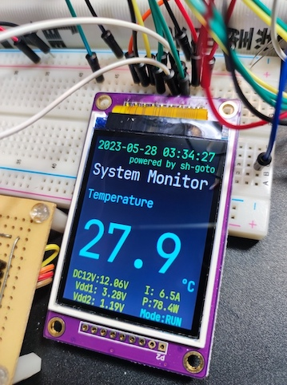
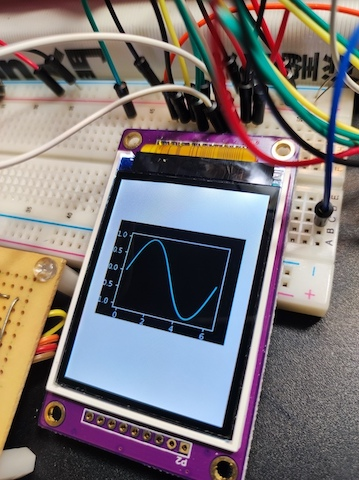

# simple-pytft

## 概要(Overview)
これは組込み向けのPythonTFT液晶ライブラリです。 
ラズパイ以外でも使えます。 
This is a Python TFT-LCD library for embedded applications. 
It can be used for other than Raspberry Pi. 

## 特徴(Feature)
* ユーザアプリ用です。
* Linux環境向けです.Micropythonは未対応.
* Raspherry Pi環境に依存しません. SPI(spidev)やGPIO(Sysfs)など最小限のI/Fを使用します.
* PillowのImageオブジェクトを画面に表示できます.
* 動画表示はパフォーマンス的にできません.
* For user applications.
* Micropython is not supported.
* Uses minimal I/F such as SPI(spidev) and GPIO(Sysfs).
* Can display Pillow's Image object on the screen.
* Video display is not possible for performance reasons.

## 対応デバイス(Supported Devices)
<dl>
    <dt>ILITEK ILI9328 SPI mode 240*320</dt>
    <dd>依存module(dependent module) : Numpy,pyspidev 
        Class : ili9328spi 
        I/F : spidev, GPIO(Sysfs)</dd>
    <dd>検証環境(test environment) 
        Board : Xilinx Zybo z7 
        SoC : Xilinx XC7Z020-1CLG400C(Zynq 7020) 
        OS : Ubuntu22.04 Linux kernel v5.15 armv7l 
        詳細(Details) : https://blog-between-hw-sw.com/howto-use-spitft-zynq4linux/
    </dd>
</dl>

## Sample Code
<dl>
    <dt>ILITEK ILI9328 SPI mode 240*320</dt>
    <dd>System Monitor</dd>

    <dd>matplotlib graph</dd>

</dl>
